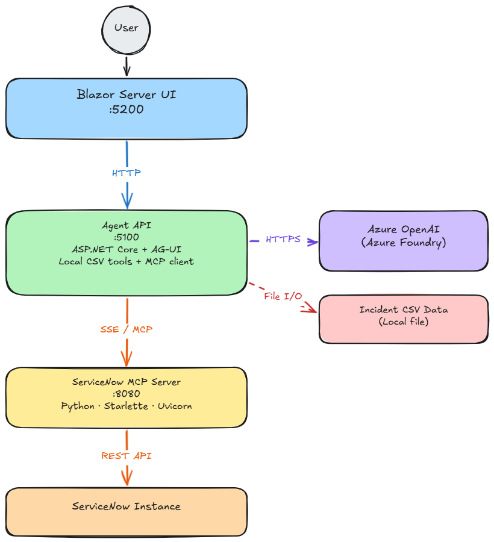

# Support Agent Hack

An agentic IT incident management assistant that combines a Blazor Server UI, an ASP.NET Core agent API backed by Azure OpenAI, and a Python-based ServiceNow MCP server.

## Architecture



## Prerequisites

| Requirement | Version |
|-------------|---------|
| .NET SDK    | 10.0+   |
| Python      | 3.11+   |
| Azure subscription with Azure OpenAI / Azure Foundry access | — |
| ServiceNow instance (optional, for MCP integration) | — |

You also need to be authenticated with Azure. The API uses `DefaultAzureCredential`, so any of the following will work:

* Azure CLI (`az login`)
* Visual Studio signed-in account
* Environment variables (`AZURE_TENANT_ID`, `AZURE_CLIENT_ID`, `AZURE_CLIENT_SECRET`)

## Getting started

### 1. Clone the repository

The `servicenow-mcp` directory is a Git submodule. Use `--recurse-submodules` to pull it automatically:

```bash
git clone --recurse-submodules https://github.com/willvelida/support-agent-hack.git
cd support-agent-hack
```

If you already cloned without the flag, initialise the submodule manually:

```bash
git submodule update --init --recursive
```

### 2. Configure the API

Edit [src/api/SupportTicketAgent/appsettings.json](src/api/SupportTicketAgent/appsettings.json) or set environment variables:

| Setting | Environment variable | Description |
|---------|----------------------|-------------|
| `AzureFoundry:ProjectEndpoint` | `AzureFoundry__ProjectEndpoint` | Your Azure Foundry / Azure OpenAI endpoint |
| `AzureFoundry:ModelDeployment` | `AzureFoundry__ModelDeployment` | Model deployment name (default `gpt-4o`) |
| `AzureFoundry:TenantId` | `AzureFoundry__TenantId` | Azure AD tenant ID (optional) |
| `McpServer:Endpoint` | `McpServer__Endpoint` | MCP SSE endpoint (default `http://127.0.0.1:8080/sse`) |

### 3. Set up the Python MCP server (optional)

If you want the ServiceNow integration, create a virtual environment and install the package:

```bash
python -m venv .venv

# Windows
.venv\Scripts\Activate.ps1

# macOS / Linux
source .venv/bin/activate

pip install -e ./servicenow-mcp
```

Set the required environment variables:

```bash
export SERVICENOW_INSTANCE_URL=https://your-instance.service-now.com
export SERVICENOW_USERNAME=<username>
export SERVICENOW_PASSWORD=<password>
```

### 4. Run all three components

Open three terminals and start each component:

**Terminal 1 — ServiceNow MCP server** (skip if not using ServiceNow)

```bash
servicenow-mcp-sse --host=127.0.0.1 --port=8080
```

**Terminal 2 — Agent API**

```bash
dotnet run --project src/api/SupportTicketAgent
```

The API starts on `http://localhost:5100`. Verify with:

```bash
curl http://localhost:5100/api/health
```

**Terminal 3 — Blazor UI**

```bash
dotnet run --project src/ui/SupportTicketAgent.UI
```

Open `http://localhost:5200` in your browser.

## Project structure

| Path | Description |
|------|-------------|
| `src/api/SupportTicketAgent/` | ASP.NET Core agent API with Azure OpenAI and MCP client |
| `src/ui/SupportTicketAgent.UI/` | Blazor Server front-end |
| `servicenow-mcp/` | Python MCP server bridging the agent to ServiceNow |
| `data/` | Synthetic incident CSV loaded by the API at runtime |

## Available agent tools

The agent exposes these tools to the LLM:

* `GetAllIncidents` — return all CSV incidents
* `GetIncident` — fetch by ID
* `SearchIncidents` — free-text search
* `GetIncidentsByState`, `GetIncidentsByPriority`, `GetIncidentsBySite`, `GetIncidentsByCategory`, `GetIncidentsByCluster` — filtered queries
* `GetIncidentSummary` — aggregated summary
* ServiceNow tools — dynamically loaded from the MCP server at startup